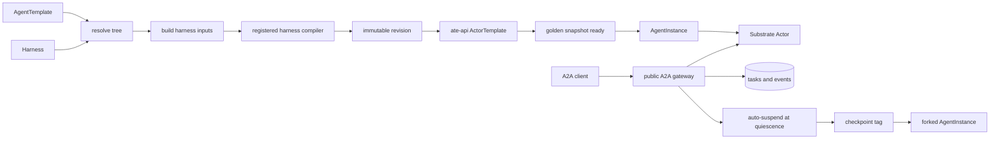

# Architecture

Kagent is a Kubernetes-native control plane for defining, compiling, running,
and invoking agents. Kubernetes stores desired agent configuration. PostgreSQL
stores runtime identity, A2A history, and lifecycle state. Substrate Actors run
the agent processes.

## Resource ownership

| Resource | Owner | Purpose |
| --- | --- | --- |
| `Harness` | Kubernetes (`kagent.dev/v1alpha3`) | Runtime implementation, workload, credentials, capacity, and admission policy |
| `AgentTemplate` | Kubernetes (`kagent.dev/v1alpha3`) | Portable agent behavior: model, prompt, tools, skills, and plugins |
| prepared revision | PostgreSQL and ate-api | Immutable compiled runtime input and its Substrate ActorTemplate |
| `AgentInstance` | PostgreSQL, exposed by gRPC | Ephemeral compute identity and lifecycle |
| A2A context, task, and events | PostgreSQL, exposed by A2A | Durable interaction and audit history |
| checkpoint | PostgreSQL plus a Substrate snapshot tag | Immutable, named restart boundary |
| Actor and durable directory | Substrate | Process lifecycle and private runtime state |

`AgentInstance` is not a Kubernetes resource. A2A owns public interaction
semantics; kagent does not maintain a parallel session or task API.

## Public surfaces

| Surface | Role |
| --- | --- |
| Kubernetes API | Author Harnesses, AgentTemplates, models, prompts, and remote MCP servers |
| gRPC / gRPC-Web | Manage AgentInstances, sharing, checkpoints, and control-plane reads |
| A2A | Invoke agents and manage durable tasks and streams |
| MCP | Discover, invoke, checkpoint, and fork AgentInstances through A2A semantics |

## End-to-end flow

Compilation and application are separate. The translator produces an immutable
revision; the controller applies it through ate-api. At runtime, the public A2A
gateway is the sole owner of task ingestion, durable event ordering, and
quiescence. It reaches Actors through the private runtime network.

## Component boundaries

- API types describe agent behavior without exposing backend mechanics.
- The v2 translator resolves references and compiles explicit runtime inputs.
- The controller reconciles compiled revisions to ate-api ActorTemplates.
- AgentInstance services and workflows own lifecycle orchestration.
- The A2A gateway owns public task routing, persistence, streaming, and
  auto-suspend boundaries.
- The store owns transactional invariants and never performs network work.
- Substrate adapters own Actor, snapshot, and private-network operations.

## Documents

- [Configuration and compilation](configuration-and-compilation.md)
- [Runtime and lifecycle](runtime-and-lifecycle.md)
- [A2A gateway](a2a-gateway.md)
- [Persistence, checkpoints, and forks](persistence-checkpoints-and-forks.md)
- [MCP](mcp.md)
- [A2A agent tools](a2a-subagents.md)
- [Human in the loop](human-in-the-loop.md)
- [Prompt resolution](prompt-templates.md)

The documents describe implemented behavior. Deferred work, including full
cross-AgentInstance delegation and Dedicated agents, belongs in the
[API v2 execution plan](../plans/api-v2-execution-plan.md).

## Current boundaries

Implemented end to end: kagent, Codex, Claude, and BYO compilation; ate-api
ActorTemplates; AgentInstance lifecycle; durable A2A tasks; auto-suspend;
checkpoint/fork; and MCP Tasks continuation.

Not implemented: Dedicated agent bindings, policy-enforced public
cross-AgentInstance delegation, checkpoint sharing, and multi-replica gateway
coordination.
