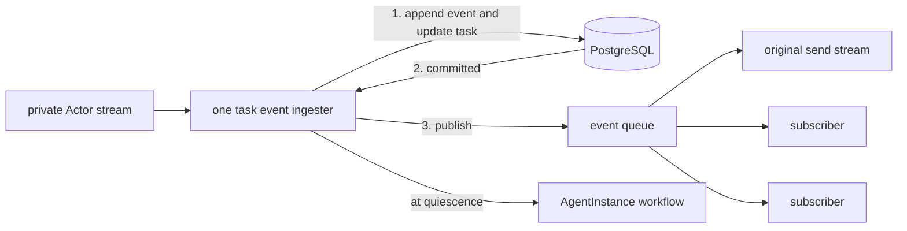

# A2A Gateway

The public gateway implements the upstream A2A handler for message send/stream,
task get/list/cancel, and subscription. It also serves the extended Agent Card
compiled into the instance's prepared revision.

## Routing and execution

Authentication establishes namespace and AgentInstance authority. The gateway
loads the instance and prepared revision, derives the private Actor route, and
forwards upstream A2A requests. Actor addresses and runtime credentials remain
internal.

Each running task has one event ingester. It alone owns runtime event consumption,
durable persistence, and the final quiescence transition; client streams and
subscribers only observe its queue. This permits multiple observers without
creating multiple Actor readers or suspending the same turn twice.

## Durable ordering

The gateway persists the task and every ordered event before publishing the event
to observers. The store atomically applies an event to materialized task state and
appends its history row. Malformed durable events fail rather than being silently
discarded.

The persistence model enforces:

- one non-quiescent task per A2A context;
- message-ID idempotency using the request hash;
- conflict rejection when an ID is reused for different content; and
- an exact snapshot identity and history sequence at each quiescent boundary.

Tasks contain current materialized A2A state. Complete message history is rebuilt
from ordered event rows, not stored as one history blob.

The implementation is in
[`go/core/v2/a2agateway`](../../go/core/v2/a2agateway).
