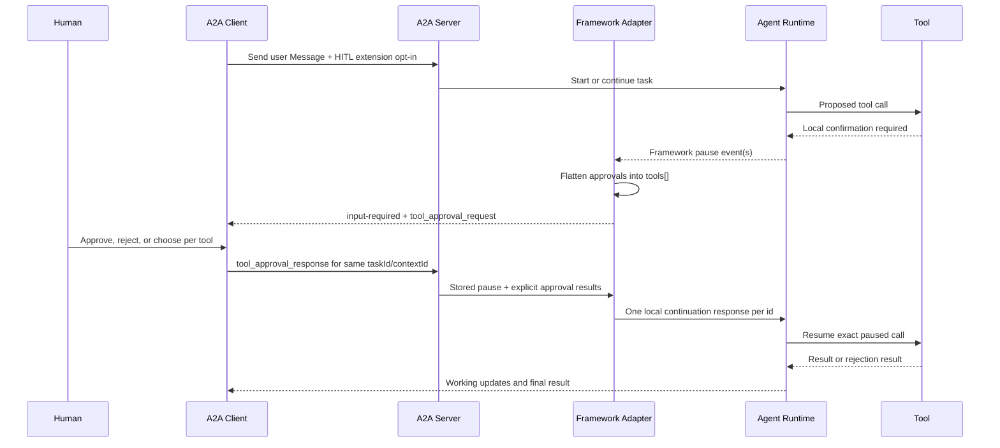
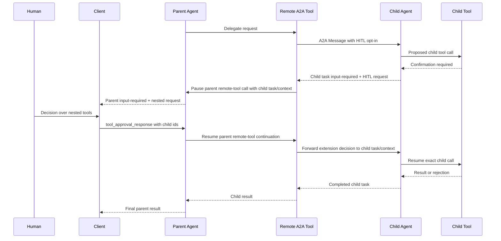

# Human-in-the-Loop

Kagent Human-in-the-Loop (HITL) lets an agent pause an A2A task, ask a human
for a decision, and resume the same task after the decision arrives. The public
contract is the framework-agnostic A2A Extension, defined in the [A2A spec](https://a2a-protocol.org/latest/specification/#46-extensions)
Google ADK confirmation events are implementation details of an adapter and are
documented separately in the appendices.

The version 1 profile of the A2A Extension supports the complete minimum HITL feature set:

- approve one or more tool calls;
- reject one or more tool calls, optionally with reasons;
- resolve several pending calls independently in one response;
- answer one or more `ask_user` questions; and
- propagate any of those interactions through a remote subagent.

An implementation advertising `hitl/v1` supports this profile as a whole. The
AgentCard does not contain separate feature flags for approval, rejection,
multi-tool responses, or `ask_user`.

## Mental model

HITL is a two-message exchange attached to an ordinary A2A task:

1. The agent sends an `input-required` status whose status Message contains a
   HITL request.
2. The client sends a user Message to the same `taskId` and `contextId` whose
   HITL payload contains explicit approval results or question answers.
3. The runtime validates the response, translates it into its local continuation
   primitive, and resumes the paused task.

No special RPC or task state is added. The task remains the unit of routing and
durability; the extension only defines the structured request and decision.
The human decision is not a new prompt asking the model to reconstruct the
call. A framework adapter resumes the exact paused operation using its stored
continuation state. The model may run again after the tool result, as it would
after any other tool call.

## Responsibilities

| Component | Responsibility |
|---|---|
| AgentCard | Declare support for the exact versioned extension URI. |
| A2A client | Opt in, render requests, collect a complete decision, and resume the same task. |
| A2A server | Negotiate the extension and route the decision to the pending task. |
| Framework adapter | Translate between the public extension and the framework's local pause/resume mechanism. |
| Tool or subagent adapter | Preserve the continuation needed to resume the exact tool or child task. |

## Extension discovery and activation

The extension URI is:

```text
https://kagent.dev/extensions/hitl/v1
```

An agent declares it in its AgentCard:

```json
{
  "capabilities": {
    "streaming": true,
    "extensions": [
      {
        "uri": "https://kagent.dev/extensions/hitl/v1",
        "description": "Tool approval, ask_user, and nested subagents",
        "required": false
      }
    ]
  }
}
```

The client opts in on the request:

```http
A2A-Extensions: https://kagent.dev/extensions/hitl/v1
```

The server activates only the exact requested URI and echoes the activated URI
on its response or event stream. A future incompatible contract uses a new URI,
for example `.../hitl/v2`; there is no silent version fallback.

**Because version 1 is optional (`required: false`), a client that does not opt in can still receive an ordinary `input-required` task with human-readable text. It cannot safely submit a structured HITL decision and must use a client that supports the extension or avoid invoking HITL features.**

## Where the payload lives

HITL data is a [Message extension](https://a2a-protocol.org/latest/specification/#462-extensions-points).
This is because Kagent uses Messages in `TaskStatusUpdateEvents` on transition to `input-required`
states to signal HITL events instead of artifacts. The Message must contain both:

```json
{
  "extensions": ["https://kagent.dev/extensions/hitl/v1"],
  "metadata": {
    "https://kagent.dev/extensions/hitl/v1": {
      "type": "..."
    }
  }
}
```

The `extensions` entry declares that the Message uses the extension. The
metadata entry contains its payload. Clients must require both; they must not
infer HITL from text or from private framework-shaped DataParts.

The Message can also contain a TextPart for display, logging, and accessibility.
That text is descriptive only and must never be parsed as the decision.

## Identifier model

Several IDs participate in a HITL flow. They are not interchangeable.

| Identifier | Scope | Used by |
|---|---|---|
| `taskId` | The paused A2A task | Client and server route the resume to the correct pending task. |
| `contextId` | The A2A conversation/session | Client resumes in the same conversation; nested calls preserve the child's context independently. |
| `id` | One resumable approval | Opaque correlation token copied unchanged from request to response. |
| `call_id` | One original tool call | UI identity, display, and audit correlation; it is not needed in the response. |

The client must return each opaque `id`, but must not interpret it. The adapter
validates every returned ID against the stored `input-required` request before
resuming anything. `name`, `args`, and `call_id` are request-only and are never
echoed back as authoritative data.

## Server to client: pausing a task

The server sends a final status update for the current stream segment:

```json
{
  "kind": "status-update",
  "taskId": "task-123",
  "contextId": "conversation-456",
  "final": true,
  "status": {
    "state": "input-required",
    "message": {
      "messageId": "message-789",
      "role": "agent",
      "taskId": "task-123",
      "contextId": "conversation-456",
      "extensions": ["https://kagent.dev/extensions/hitl/v1"],
      "metadata": {
        "https://kagent.dev/extensions/hitl/v1": {
          "type": "tool_approval_request",
          "hint": "Deleting this file requires approval",
          "tools": [
            {
              "id": "approval-1",
              "call_id": "call-1",
              "name": "delete_file",
              "args": {"path": "/tmp/example"}
            }
          ]
        }
      },
      "parts": [
        {"kind": "text", "text": "Approval required for delete_file"}
      ]
    }
  }
}
```

The client should persist the status Message as part of the task state. On page
reload, it can reconstruct an unresolved HITL interaction from a task whose
current state is still `input-required`.

### Case 1: one tool approval

For a single entry in `tools`, render the tool name and arguments and offer
Approve and Reject. A rejection UI may optionally collect a free-text reason.

The client must treat `args` as untrusted display data. Rendering an approval
card must not execute the tool or interpret arguments as HTML.

### Case 2: several pending tools

Parallel framework confirmations are flattened into one list of independently
resumable approvals:

```json
{
  "type": "tool_approval_request",
  "hint": "Two operations require approval",
  "tools": [
    {
      "id": "approval-21",
      "call_id": "call-delete",
      "name": "delete_file",
      "args": {"path": "/tmp/old"}
    },
    {
      "id": "approval-22",
      "call_id": "call-restart",
      "name": "restart_deployment",
      "args": {"name": "api", "namespace": "production"}
    }
  ]
}
```

This is a flat list of two independent approvals. “Approve all” is only a UI
shortcut: the response still contains one explicit result per `id`.

### Case 3: ask the user

`ask_user` is a separate request type because answers are not approve/reject
decisions:

```json
{
  "type": "ask_user_request",
  "id": "approval-question-1",
  "questions": [
    {
      "question": "Which database should be used?",
      "choices": ["PostgreSQL", "MySQL", "SQLite"],
      "multiple": false
    },
    {
      "question": "Which optional features should be enabled?",
      "choices": ["Authentication", "Caching", "Audit logging"],
      "multiple": true
    },
    {
      "question": "Any additional requirements?",
      "choices": [],
      "multiple": false
    }
  ]
}
```

The user can select listed choices or provide free text. Answers are positional:
answer zero corresponds to question zero, and so on. An individual answer is an
array because a multiple-choice question may select several values.

### Case 4: a remote subagent needs input

A parent agent can pause because a child A2A task returned `input-required`.
The top-level `tools` entry represents the parent's remote-agent tool
continuation. The `nested` object describes what the child is waiting for:

```json
{
  "type": "tool_approval_request",
  "hint": "Remote agent k8s_agent requires approval",
  "tools": [
    {
      "id": "parent-approval-1",
      "call_id": "parent-call-1",
      "name": "k8s_agent",
      "args": {"request": "Remove the obsolete pod"}
    }
  ],
  "nested": {
    "subagent_name": "k8s_agent",
    "task_id": "child-task-1",
    "context_id": "child-context-1",
    "tools": [
      {
        "id": "child-approval-1",
        "call_id": "child-call-1",
        "name": "delete_pod",
        "args": {"name": "obsolete", "namespace": "production"}
      }
    ]
  }
}
```

The UI displays `nested.tools`, because those are the operations the human is
actually authorizing, and returns their opaque IDs. The parent adapter retains
the top-level ID so it can resume the remote-agent tool, then forwards the
child results using the child IDs.

While the child is paused, the Kagent UI also renders the parent AgentCall card
and uses `nested.context_id` to open that child session in its Activity panel.
This is especially important for isolated subagent sessions, where the session
ID exists only for that individual remote call.

A nested `ask_user_request` has the same `questions` field as a direct request
and includes `nested` for attribution and child task routing.

## Client to server: resuming a task

The client sends a user Message using `message/stream` (or the corresponding
non-streaming send operation) with the same `taskId` and `contextId`. It opts in
again with the `A2A-Extensions` header and attaches a response payload.

```json
{
  "messageId": "approval-response-1",
  "role": "user",
  "taskId": "task-123",
  "contextId": "conversation-456",
  "extensions": ["https://kagent.dev/extensions/hitl/v1"],
  "metadata": {
    "https://kagent.dev/extensions/hitl/v1": {
      "type": "tool_approval_response",
      "approvals": [
        {"id": "approval-1", "approved": true}
      ]
    }
  },
  "parts": [
    {"kind": "text", "text": "Approved"}
  ]
}
```

### Tool approval response

```json
{
  "type": "tool_approval_response",
  "approvals": [
    {
      "id": "approval-21",
      "approved": false,
      "rejection_reason": "The file is still used by the migration job"
    },
    {
      "id": "approval-22",
      "approved": true
    }
  ]
}
```

Every `id` exposed by the applicable `tools` list must appear exactly once.
Missing, duplicate, and unknown IDs are invalid; omission must never silently
mean approval. A rejection reason is optional and belongs directly to its
rejected approval. For nested HITL, return IDs from `nested.tools`, not the
parent remote-tool entry.

### Answer `ask_user`

```json
{
  "type": "ask_user_response",
  "id": "approval-question-1",
  "answers": [
    {"answer": ["PostgreSQL"]},
    {"answer": ["Authentication", "Caching"]},
    {"answer": ["Use the existing backup policy"]}
  ]
}
```

The number and order of answer objects must match the questions. For a nested
question, the response uses the child question ID from `nested.tools`.

## Validation and stale decisions

A server should reject a decision when any of these conditions is true:

- the Message does not declare the HITL extension;
- its extension payload is missing or has an unknown `type`;
- the target task is absent or is no longer `input-required`;
- the response type does not match the pending request type;
- an approval response omits an ID, repeats an ID, or contains an unknown ID;
- an `ask_user` response has missing or malformed answers; or
- the stored pause has no usable approval correlation.

Clients should guard against two tabs answering the same pause. Before sending,
refresh or compare the current task state. Once one decision has been accepted,
later submissions are stale and must not resume another operation.

An accepted decision may be retained in task history for audit and UI display,
but the framework adapter consumes a translated continuation message rather
than treating the human-readable TextPart as framework input.

## Direct end-to-end flow



## Nested end-to-end flow



Each hop owns only its local continuation. The public response remains the same
A2A extension shape at every remote boundary. This permits recursive nesting,
although deep agent chains are harder to operate and debug.

## Building another framework adapter

A framework adapter implementing `hitl/v1` needs five capabilities:

1. Detect local pauses for tool approval and user questions.
2. Convert every local approval into a public tool with a stable opaque `id`,
   original `call_id`, name, and arguments.
3. Persist enough local continuation state to resume the exact operation after
   the A2A task is stored and the original request has ended.
4. Validate a response against the stored public pause and create one local
   continuation response per approval.
5. For remote agents, preserve child `task_id` and `context_id` and forward the
   same A2A response shape to that child.

The adapter should not ask the model to recreate a paused call, scan display
text, or make the client return private framework state. If its framework
already owns durable confirmation matching, delegate matching to that upstream
mechanism.

## Operational and debugging guide

When a client does not show an approval card, verify in order:

1. The AgentCard declares the exact HITL URI.
2. The request includes `A2A-Extensions` with that URI.
3. The response echoes the activated URI.
4. The task state is `input-required`.
5. `status.message.extensions` includes the URI.
6. `status.message.metadata[URI]` has a recognized request type.

When a response does not resume execution, verify:

1. The decision uses the same `taskId` and `contextId` as the pause.
2. The task is still `input-required` and has not already been answered.
3. The response Message declares the extension and has the matching response type.
4. Its approval IDs exactly match the IDs displayed by the pending request.
5. The framework adapter can resolve every returned opaque `id`.
6. For a subagent, the child task and context still identify its pending task.

Useful logs should include task ID, context ID, request type, approval count,
response type, and subagent name. Avoid logging secrets contained in tool
arguments or free-text answers.

---

## Appendix A: Google ADK concepts

Google ADK tools call `request_confirmation()` when a proposed operation needs
human approval. ADK represents the pause as an
`adk_request_confirmation` function call containing:

- the original function call name, arguments, and call ID;
- a separate confirmation function-call ID; and
- a `ToolConfirmation` containing a hint and optional tool-owned payload.

These objects are internal to the ADK adapter. At the A2A boundary:

| ADK internal value | A2A HITL value |
|---|---|
| Confirmation function-call ID | `id` |
| Original function-call ID | `call_id` |
| Original function name and arguments | `tools[].name` and `tools[].args` |
| Confirmation hint | `hint` or the status TextPart |
| Several confirmation calls | Flat `tools[]` list |
| Confirmation FunctionResponse | Adapter-generated local continuation response |

For a direct approval, ADK reinvokes the original tool with the resulting
`ToolConfirmation`. The before-tool approval callback allows execution when
confirmed and returns a rejection result when denied. Rejection reasons can be
included in the confirmation payload so the model receives useful context.

The built-in `ask_user` tool uses the same local confirmation mechanism, but
the adapter stores structured answers in the confirmation payload. The tool
returns question/answer pairs to the model.

## Appendix B: Go ADK adapter

The Go adapter is intentionally thin around upstream Go ADK 2.x.

### Request path

1. Upstream ADK emits one `adk_request_confirmation` call per pending tool.
2. The upstream A2A executor converts those calls into internal long-running
   function-call parts and produces `input-required`.
3. Kagent's `BuildHITLStatusMessage` removes the ADK-shaped parts from the
   public status Message, flattens them into `tools[]`, and attaches the HITL
   extension when it was negotiated.
4. Each ADK confirmation call ID becomes that tool's opaque `id`.

### Response path

1. A2A routing supplies both the stored `input-required` task and the incoming
   response to `KAgentExecutor`.
2. `BuildResumeHITLMessage` validates the response against the stored public
   request and builds one ADK confirmation FunctionResponse per
   returned `id`.
3. The ordinary upstream ADK executor receives those responses.
4. Upstream ADK looks up its own session, matches confirmation responses to
   pending calls, and resumes the original tools.

Kagent Go code does **not** scan ADK session history for pending confirmations.
It owns only A2A negotiation and translation; upstream ADK owns session
matching and tool continuation.

### Go remote subagent

`KAgentRemoteA2ATool` activates the HITL extension on outbound child requests.
If the child returns `input-required`, it translates the child's public request
into local confirmation state containing the child task, context, subagent
name, and inner tools. The parent exposes that state as `nested`.

After the parent confirmation resumes, the remote tool reconstructs an A2A
`tool_approval_response` from the retained child IDs and sends it to the saved
child task and context. `ask_user` answers and rejection reasons are preserved.

## Appendix C: Python ADK adapter

The Python runtime currently uses Google ADK before 2.0, whose A2A executor does
not yet provide the same upstream confirmation-resume behavior as Go ADK 2.x.
Its adapter therefore duplicates a limited amount of private ADK semantics as a
temporary compatibility layer.

### Request path

1. The Python runner emits long-running ADK confirmation events.
2. `_split_hitl_artifact_parts` separates confirmation parts from ordinary
   artifact output.
3. `build_hitl_status_message` converts those parts into a public A2A HITL request
   and emits an `input-required` status.
4. ADK-shaped confirmation DataParts do not cross the public A2A boundary.

### Response path

1. The executor parses the public tool-approval or ask-user response.
2. `_find_pending_confirmations` scans the Python ADK session for the most
   recent unanswered confirmation calls.
3. `_process_hitl_response` builds the corresponding ADK
   `ToolConfirmation` FunctionResponses and preserves tool-owned payload state.
4. The Python runner resumes with those FunctionResponses.

This session scan is Python-specific compatibility code, not part of the A2A
extension and not a pattern to copy into the Go adapter or a new framework
adapter. The intended follow-up is to remove it when Python migrates to an
upstream ADK version that owns confirmation matching.

Python and Go now expose the same request and response models. Each public tool
has an opaque `id`; each response returns that ID with an explicit boolean.

### Python remote subagent

`KAgentRemoteA2ATool` uses a two-phase invocation. On the first invocation it
sends an A2A request to the child. When the child pauses, the tool calls
`request_confirmation()` on the parent and stores the child task/context and
the validated public request in its private ADK payload. The parent executor
stores the validated public response alongside that request. When ADK
reinvokes the tool with a confirmation, the tool forwards that response to the
saved child task unchanged.

Python still scans its private ADK session as a temporary compatibility layer,
but its public edge—including nested subagents—uses the same framework-neutral
ID-based contract as Go.

`ToolConfirmation` and session scanning remain adapter internals. The stable
interface for clients and non-ADK runtimes is the A2A extension described in
the main body of this document. The remote adapter deliberately stores the
public `hitl_request` and `hitl_response` objects instead of reconstructing an
ADK-shaped `hitl_parts` representation.

## Appendix D: Built-in `ask_user` tool

The built-in tool accepts one or more questions in one call:

```python
ask_user(questions=[
    {
        "question": "Which database should I use?",
        "choices": ["PostgreSQL", "MySQL", "SQLite"],
        "multiple": False,
    },
    {
        "question": "Which features do you want?",
        "choices": ["Auth", "Logging", "Caching"],
        "multiple": True,
    },
    {
        "question": "Any additional requirements?",
        "choices": [],
        "multiple": False,
    },
])
```

After the client returns positional answers, the tool result supplied to the
model is conceptually:

```python
[
    {"question": "Which database should I use?", "answer": ["PostgreSQL"]},
    {"question": "Which features do you want?", "answer": ["Auth", "Caching"]},
    {"question": "Any additional requirements?", "answer": ["Add rate limiting"]},
]
```

`ask_user` is a structured human-input operation, not a tool approval with an
implicit approval value. That distinction is why the public protocol uses
`ask_user_request` and `ask_user_response`.
