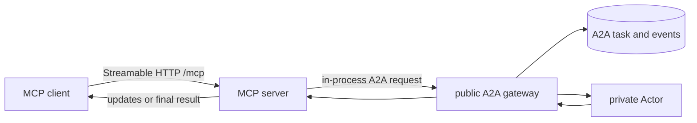

# MCP

Kagent exposes an authenticated, stateless Streamable HTTP MCP endpoint at
`/mcp` on the HTTP port (`8083`). It is another client of the public control-plane
semantics, not a private path to Actors.

Current tools can:

- list accessible AgentInstances;
- invoke an AgentInstance;
- create and list checkpoints; and
- fork an AgentInstance from a checkpoint.

Invocation calls the in-process public A2A gateway. Streaming MCP clients receive
updates from the same durable A2A task; synchronous clients drain the same stream
to completion.

## MCP Tasks

The server implements the MCP Tasks extension. An opaque base64 task reference
contains the authorized namespace, AgentInstance, and A2A task identity.
`tasks/get`, `tasks/update`, and `tasks/cancel` translate to operations on that
same durable A2A task, including `input-required` continuation. There is no
separate MCP task or session store.

The implementation is in [`go/core/internal/mcp`](../../go/core/internal/mcp).
