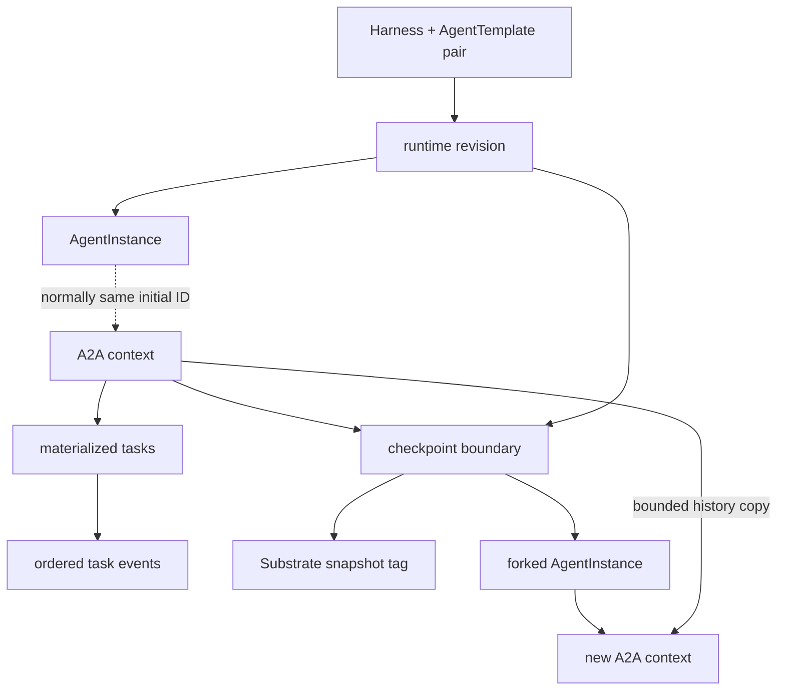

# Persistence, Checkpoints, and Forks

## Durable interaction model

`AgentInstance` represents ephemeral compute. An A2A context durably owns its
tasks and ordered events, allowing interaction history to remain as an audit trail
after compute is removed. Normally a newly created context ID equals its
AgentInstance ID, but they are separate identities.

The core PostgreSQL records are:

| Record | Purpose |
| --- | --- |
| `runtime_revision` | Immutable compiled input and ate-api identity |
| `agent_template_harness_pair` | Pair status and latest successful revision |
| `agent_instance` | Compute identity, pinned revision, lifecycle phase, and Actor identity |
| `agent_instance_share` | Instance authorization grants |
| `a2a_context` | Durable owner of interaction history |
| `agent_instance_task` | Materialized current A2A task state |
| `agent_instance_task_event` | Append-only ordered task and message events |
| `agent_instance_checkpoint` | Named immutable snapshot/history boundary |

Identity columns use PostgreSQL's native UUID type. Other framework-specific
tables are runtime implementation details, not part of this ownership model.

## Checkpoint creation

A checkpoint names a quiescent boundary already recorded by the gateway. Creating
one does not suspend the Actor again:

1. Reserve the checkpoint in PostgreSQL.
2. Verify the exact Substrate snapshot UID and scope recorded on the boundary.
3. Create an immutable snapshot tag.
4. Persist the tag UID and mark the checkpoint ready.

The checkpoint retains source-instance provenance, source context, prepared
revision, labels, head task, and history sequence. The source AgentInstance may be
deleted while its context and checkpoint remain.

Deletion first hides the checkpoint, then deletes its snapshot tag, then removes
the row. A checkpoint referenced by a fork cannot be deleted. Snapshot garbage
collection is a separate concern.

## Forking

Forking creates a new AgentInstance and A2A context. It copies task/event history
through the checkpoint sequence, deterministically remapping task and message IDs,
then creates the Actor from the checkpoint's snapshot tag. New work appends only
to the fork's context; source history and the checkpoint remain immutable.

Checkpoint sharing is not implemented. Future sharing must be restricted to data
snapshots without process state.

The workflow lives in
[`go/core/v2/checkpoint`](../../go/core/v2/checkpoint).
